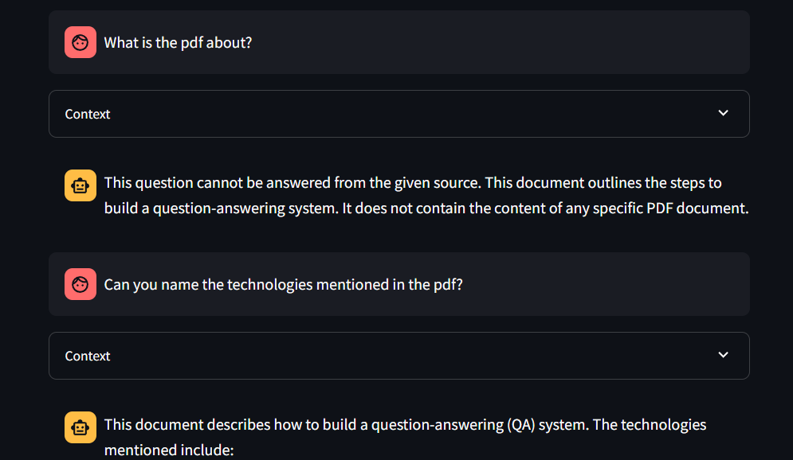
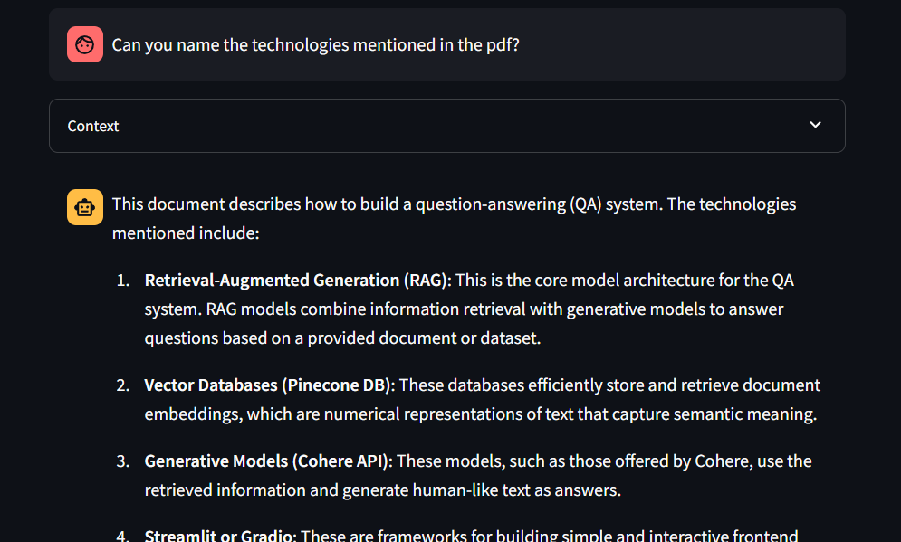
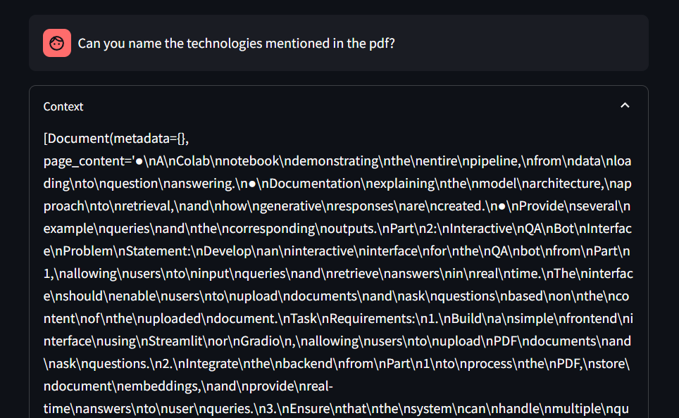

# This repository is about RAG Application development

In `part1/SampleSetAssessment.ipynb` contains the main backend logic for the project. 
It demonstrates how the application works and the driver logic code is also in the same file. Since it is a jupyter notebook, required dependencies are mentioned in the book itself

In `part2`, I have created a streamlit based frontend to host my RAG application. This application is hosted on streamlit cloud and this directory contains the streamlit and `part1` code too.

In order to use part2, install the required libraries

```bash
pip install -r requirements.txt
```
---
## Examples for Part 2





